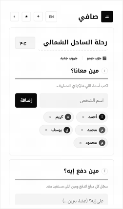
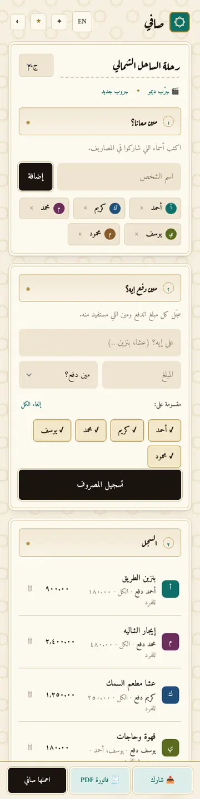
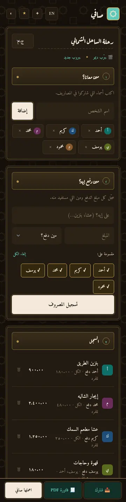
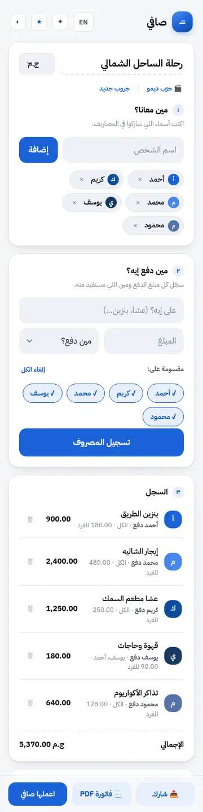
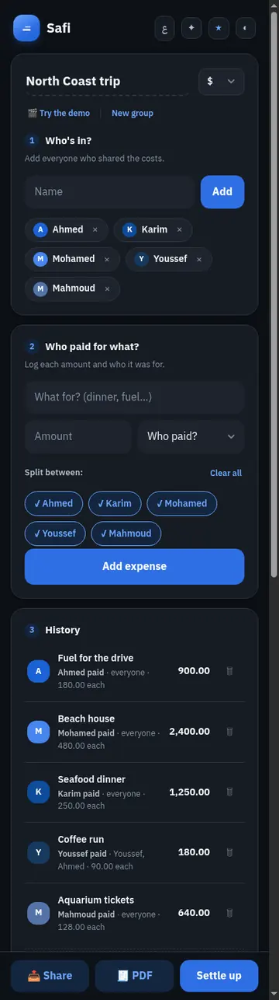
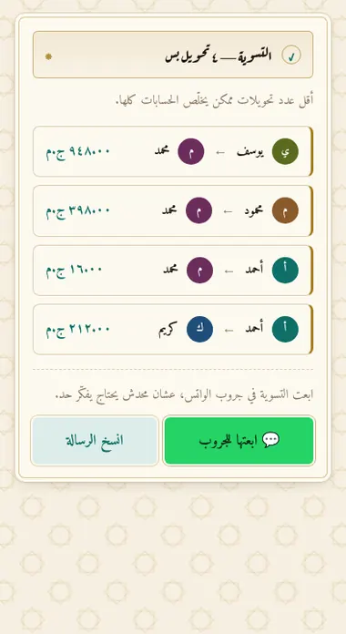
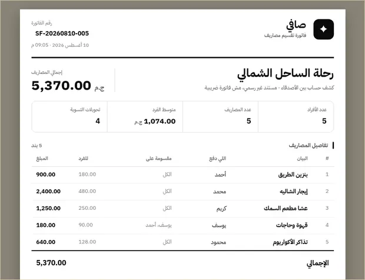

<div align="center">

# صافي · Safi

**Split shared expenses with friends. No sign-up, no account, no server.**

[](https://sersawy.github.io/safi/)
[](https://github.com/sersawy/safi/stargazers)
[](https://hits.sh/github.com/sersawy/safi/)
[](LICENSE)



</div>

---

Log who paid for what, and Safi tells you the **fewest transfers** that clear every
balance. Share a group by link — the whole state is encoded in the URL, so there is
nothing to sign up for and nothing stored on a server.

Arabic-first (`دعم كامل للغة العربية`), with English available.

## Themes

Two complete visual systems, each with light and dark modes.

| عربي أصيل — default | عربي أصيل · dark |
|:---:|:---:|
|  |  |
| Naskh type, parchment ground, eight-point star tessellation, illuminated headings, Arabic-Indic numerals | Lamplight on leather — not an inverted page |

| Modern | Modern · dark · English |
|:---:|:---:|
|  |  |
| Four colors only: white, black, blue, red | Full LTR mirroring |

## Two features worth calling out

<table>
<tr>
<td width="50%" valign="top">

### Send it to the group



The hard part of splitting a bill is not the arithmetic — it is asking your friends
for money. One tap turns the settlement into a message, so the app does the asking.

```
🧾 صافي — رحلة الساحل الشمالي

إجمالي المصاريف: ٥٬٣٧٠٫٠٠ ج.م

التسوية المطلوبة:
• يوسف يدفع لـ محمد: ٩٤٨٫٠٠ ج.م
• محمود يدفع لـ محمد: ٣٩٨٫٠٠ ج.م
• أحمد يدفع لـ محمد: ١٦٫٠٠ ج.م
• أحمد يدفع لـ كريم: ٢١٢٫٠٠ ج.م

التفاصيل كلها هنا:
https://…/#g=eyJuYW1l…
```

Opens WhatsApp with the message ready to send, or copies it for any other app.
No phone numbers, no accounts.

</td>
<td width="50%" valign="top">

### PDF invoice



A real A4 document: every expense, each person's share, the transfers required, and
signature lines. Downloads directly — no print dialog.

The invoice is **rasterized on purpose**. jsPDF has no Arabic shaping or bidi, so
laying out text runs would emit «صافي» as disconnected, reversed letters. The browser
shapes it correctly, so the page is photographed instead. Page breaks snap to measured
element bounds, so a table row is never sheared in half.

</td>
</tr>
</table>

## Features

- **Minimum transfers** — greedy largest-first settlement; pairing the biggest debtor
  with the biggest creditor clears at least one of them per transfer.
- **Share by link** — group state is base64url-encoded into the URL fragment. No backend.
- **Send to the group** — the settlement as a ready-to-send WhatsApp message.
- **PDF invoice** — one-click download, correct Arabic, page breaks that never cut a row.
- **Bilingual** — Arabic (default) and English, with full RTL/LTR mirroring.
- **Two skins × three color modes** — light, dark, or follow the OS.
- **Offline-tolerant** — the app itself has zero runtime dependencies; only PDF export
  fetches a library, and it falls back to the print dialog when offline.

## Development

```bash
python3 -m http.server 8000     # ES modules need HTTP; file:// fails on CORS
node tools/verify.mjs           # 28 checks in headless Chromium
node tools/screenshots.mjs      # regenerate everything in docs/media
```

`verify.mjs` asserts the things that have actually broken here before: balances summing
to zero, transfers clearing every balance, the PDF rendering something other than a blank
canvas, Arabic staying shaped, and both languages having every key.

## Deploy

No build step. Static files, served as-is.

**Settings → Pages → Deploy from a branch → `main` / `(root)`**

`.nojekyll` is committed so Jekyll doesn't strip `_`-prefixed paths. After deploying,
set `GITHUB` in [`assets/js/config.js`](assets/js/config.js) to your repository URL so
the star button points at the right place.

## Architecture

```
index.html              structure only — every string via data-i18n
assets/css/
  tokens.css            the token contract every skin must satisfy
  base.css              reset + page
  components.css        components — reads only tokens, knows no skin
  bill.css              the PDF document
  skins/
    modern.css          tokens for the modern skin
    asil.css            tokens for عربي أصيل
    asil-ornament.css   the ornament that makes it a manuscript page
assets/js/
  config.js             skin registry, repo URL, CDN endpoints
  share.js              settlement → WhatsApp / clipboard message
  i18n.js               dictionaries + t() + string painting
  state.js              state, persistence, link encoding
  settle.js             the settlement math — no DOM
  ui.js                 rendering
  bill.js               builds the invoice DOM
  pdf.js                rasterizes and paginates it
  theme.js              color mode + skin
  main.js               boot and event wiring
tools/
  verify.mjs            headless assertions, no dependencies
  screenshots.mjs       regenerates docs/media
```

`settle.js` is pure math and `bill.js` produces only DOM, so both can be exercised
without rendering a PDF.

## Adding a theme

Four steps, none of which touch component CSS. See [CONTRIBUTING.md](CONTRIBUTING.md).

1. `assets/css/skins/<id>.css` — define every token listed in `tokens.css`
2. `index.html` — link the stylesheet
3. `assets/js/config.js` — add an entry to the `SKINS` registry
4. `assets/js/i18n.js` — add a label under `skin:` in each language

## Notes

- **The PDF is an image, not text.** jsPDF has no Arabic shaping or bidi — «صافي» would
  emit as disconnected, reversed letters. The browser shapes the text correctly, so we
  photograph it. Trade-off: PDF text is not selectable or searchable.
- **`letter-spacing` and `overflow-wrap: anywhere` are banned inside the invoice.**
  Either one makes html2canvas lay text out glyph-by-glyph, which severs Arabic joining
  and drops the spaces between words.
- **html2canvas cannot capture an out-of-flow element** — it returns a blank canvas. The
  invoice is briefly returned to normal flow behind an overlay while it is captured.
- **The page-view counter is a third-party request** and the only outbound call made at
  load. Set `COUNTER.enabled = false` in `config.js` to remove it.

## License

MIT — see [LICENSE](LICENSE).
